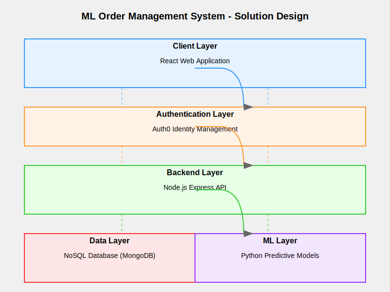
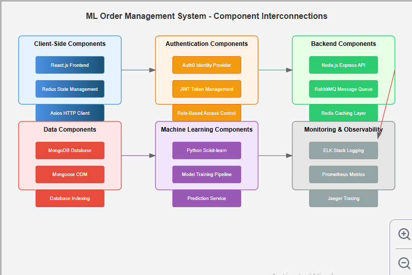
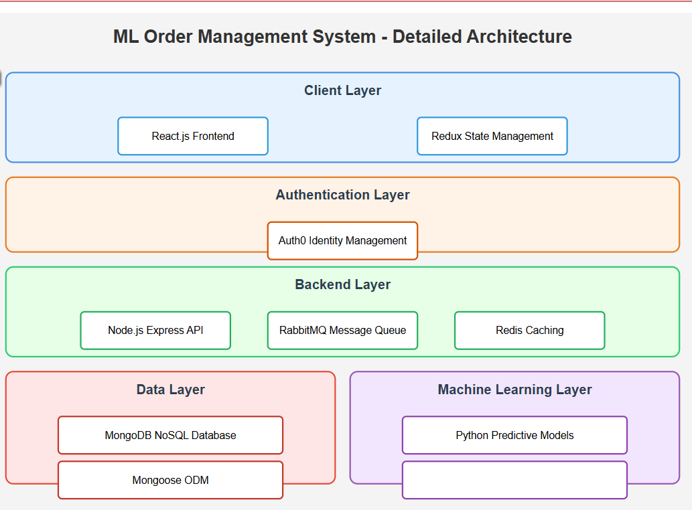

# ML-Order-Management-System

## Project Overview
The ML Order Management System is an intelligent web application that leverages machine learning to streamline order processing and management. This project combines modern web technologies with predictive analytics to provide a seamless ordering experience for customers and efficient order tracking for business owners.
Who is it for?

* Customers: Individuals looking for a user-friendly order creation and management platform
* Business Owners: Managers and administrators needing a robust system to track and manage orders
* Tech Enthusiasts: Developers interested in a full-stack machine learning application implementation

I'll create a comprehensive GitHub README artifact for this machine learning project template.

Let me elaborate on the machine learning model's purpose in this system, which I've highlighted in the README.

# The machine learning model serves three primary strategic purposes:

1. *Predictive Order Processing
   - By analyzing historical order data, the model can predict potential order cancellations before they occur
   - It can optimize order routing by understanding patterns in order processing times and customer preferences
   - The model might learn to anticipate bottlenecks or delays in the order lifecycle

2. *Customer Behavior Insights
   - The ML model can segment customers based on their ordering patterns
   - It can generate personalized recommendations for products or services
   - By understanding individual customer behaviors, it can predict future ordering trends

3. *Operational Efficiency
   - Forecasting order volumes helps in resource allocation
   - Detecting anomalies in order processing can prevent potential issues
   - The model can continuously learn and improve its predictive capabilities

The machine learning component adds an intelligent layer to what would otherwise be a standard order management system. Instead of just processing orders, the system now has predictive and adaptive capabilities that can provide competitive advantages like:
- Reduced order cancellations
- Improved customer satisfaction
- More efficient resource management
- Data-driven business insights

Would you like me to elaborate on any specific aspect of the machine learning model's integration or purpose?

# Solution Design

## The solution is designed with a layered approach:

* Presentation Layer: React-based web interface
* Authentication Layer: Auth0 for secure user management
* Business Logic Layer: Node.js backend with machine learning integration
* Data Layer: NoSQL database for flexible data storage
* Machine Learning Layer: Predictive models for order optimization

## High-Level Requirements
## Customer Use Cases

* As a customer, I need to be able to create a new order
* As a customer, I need to be able to update an existing order
* As a customer, I need to be able to cancel a new order

## Owner Use Cases

* As an owner, I am able to view pending orders
* As an owner, I can manage and track order statuses

# Features Implemented

 * Customer authentication using Auth0
 * Order creation functionality
 * Order update capabilities
 * Order cancellation process
 * Owner dashboard for order management
 * Integrated unit and integration tests

# Assumptions

### Customer will primarily use the web application
### Initial version does not require complex reporting
### Basic machine learning predictions will be implemented
### Scalability is a future consideration

# Future Enhancements

### Implement email-based login
### Advanced machine learning order prediction
### Comprehensive reporting dashboard
### Mobile application support
### Advanced analytics and insights

# Challenges

### Version incompatibility between libraries
### Integrating machine learning models with web application
### Ensuring smooth user authentication
### Maintaining performance with increasing order volume

# Design Decisions
NoSQL vs Relational Database

## Why NoSQL was Preferred:

* Flexible schema for evolving order structures
* Horizontal scalability
* Better performance for read-heavy workloads
* Easier integration with machine learning workflows
* Simplified data model for order management

# Installation
Prerequisites

### Node.js (v16+)
### npm (v8+)
### MongoDB
### Python (v3.8+)

# System Design 

# Detailed Architecture

# Steps

## 1.Clone the repository

